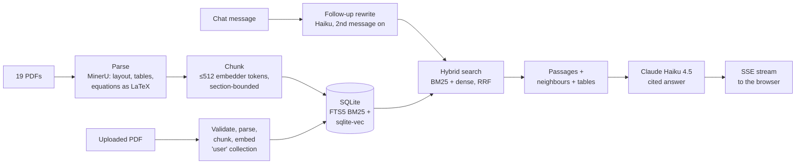

# thesis-rag

A chat assistant over the 19 research papers behind my skripsi (stock-price models
built on differential equations, volatility, geopolitical risk, numerical methods).
Ask in plain language ("explain like I'm 12: what does the logistic model say about
the IDX Composite?") and follow up ("why?", "what about the other papers?"). Every
claim about a paper is cited to its section and page. General explanations are
labelled as such. When the papers don't cover something, it says so instead of
guessing. You can also upload your own PDF and ask about that.

It's built to be checked, not just demoed: a 66-question gold set measures whether
the right passage is found and whether the answer is correct and faithful to it.

## How it works



- **Parsing** (`rag/parse/`): four interchangeable backends behind one `ParsedDoc`
  schema. The core corpus uses MinerU (ML layout, tables and formula recognition);
  uploads use the fast rule-based PyMuPDF parser. Sidebars, running headers,
  licence boilerplate, references and duplicated text layers are removed; sections
  are labelled (abstract, methodology, results...).
- **Chunking** (`rag/chunk.py`): chunks are sized in the embedding model's own
  tokens, so none is silently truncated. Each starts with a context header
  ("Smales 2019 — title > heading"); each paper also gets an overview card.
- **Index** (`rag/index.py`): one SQLite file with FTS5 (keyword search, porter
  stemming) and sqlite-vec (bge-small-en-v1.5 embeddings, cosine). 647 chunks,
  about 4 MB. No vector database needed at this size.
- **Retrieval** (`rag/retrieve.py`): BM25 and dense results fused with Reciprocal
  Rank Fusion. The top 2 of each retriever are guaranteed a slot. A per-paper cap
  applies only to "which papers..." questions. Naming an author or paper id lifts
  the cap, so that paper can fill the context.
- **Generation** (`rag/generate.py`, `rag/chat.py`): each hit is widened with its
  neighbouring chunks, and tables it refers to ("see Table 5") are attached.
  Citation markers are checked against the passages actually sent. Invalid ones
  are removed, and answers with none are logged as failures. In a chat, follow-ups
  are rewritten into standalone searches. "Say that more simply" reuses the
  previous passages instead of searching again.
- **App** (`app/`): FastAPI with Server-Sent Events, and a plain HTML/CSS/JS
  frontend (KaTeX for equations). Guards: access code, 10 questions a minute, and
  a daily question cap as a spend limit.

## Evaluation

Gold set: 66 questions written from the papers (`eval/gold_questions.jsonl`):
factoid, numeric, method, equation, comparison, aggregation, discrepancy
(abstract vs. tables) and 4 the corpus can't answer. A second set of 20 is
reworded in everyday language (`eval/gold_paraphrased.jsonl`). Evaluation only
ever searches the core collection, so uploads can't move these numbers (enforced
by a test).

### Retrieval (`make eval-retrieval`, $0)

| | original wording | everyday wording |
|---|---|---|
| right paper in top 6 (hit@6) | **100%** | **100%** |
| right paper ranked first (hit@1) | 93.5% | 75% |
| answer text in what the model reads (evidence@6) | **92%** | **70%** |
| multi-paper questions: papers covered | 78% | 60% |

`evidence@6` is the strict one: do the gold answer's key strings (a number, an
equation) actually appear in the passages sent to the model? It was added after a
live question failed even though the right paper was retrieved. Three fixes raised
it from 87% / 60% (DECISIONS.md). Cross-encoder rerankers were tried and rejected:
no gain, and +3.5 s per question on CPU.

### Answers (`make eval-answers`, Haiku 4.5 answering, Sonnet 5 judging)

| metric | result |
|---|---|
| accuracy (judge: correct on all key facts) | 76.9% |
| faithfulness (every claim supported by the passages) | 89.2% |
| answers without a valid citation | 0 |
| numeric questions | 100% |
| unanswerable questions correctly declined | 100% |
| comparison / aggregation (multi-paper) | 50% / 60% |
| cost | $0.51 per 100 questions, median latency 2.8 s |

This run found over-refusal: the model declined when the passages held only part
of the answer. The prompt now requires partial answers. The run predates that fix
and chat mode, so these numbers are a baseline, not the current state.

## Parsing decisions (what broke, what fixed it)

| problem | fix |
|---|---|
| Two-column papers read across columns (p10) | per-page column detection and reading order |
| MDPI sidebars and licence notes in the body text (p16, p18) | sidebar and boilerplate filters |
| p18's PDF has every line twice in its text layer | near-duplicate line removal |
| Cover pages and repeated download footers (p12, p14) | page drop rules and footer filters |
| Equations lost: PyMuPDF sees symbol fonts, so 165 equations became placeholders | MinerU backend: 152 equations recovered as LaTeX, quoted verbatim in answers |
| Tables missed (rules only, no cell borders) | caption-anchored table finding; MinerU finds 16 tables vs 11 on the same 5 papers |
| 44% of chunks silently truncated by the embedder (512 tokens) | chunks sized in the embedder's tokenizer: 0 truncated |

Full reasoning for every deviation from the original plan is in
[DECISIONS.md](DECISIONS.md).

## Known limitations

- **Figures aren't read.** Numbers that only appear in a chart are invisible (q45).
- **Everyday wording retrieves worse** (70% vs 92% evidence). Dense search alone
  does better on reworded questions; tuning the fusion weights is the next step.
- **Multi-paper questions** ("which papers use GARCH?") are the weakest type: six
  passages can't cover five papers in depth.
- **English only**, and a small corpus: 19 papers. Built for this collection, not
  tuned for any PDF.
- **Uploads** use the fast parser (no equation recognition). Scanned PDFs are
  rejected, since there is no text to index. Rebuilding the index (`make index`)
  drops uploads.
- **Hosting:** Hugging Face now requires a paid plan for Docker Spaces. The demo
  runs locally; the Dockerfile and `scripts/deploy_space.py` are ready for a host.

## Run it yourself

The papers are not redistributed: several aren't open access. `data/manifest.yaml`
lists each one with its DOI so you can fetch them. Needs [uv](https://docs.astral.sh/uv/)
and Python 3.11.

```bash
uv sync
# put the PDFs in data/raw/ (file names as in data/manifest.yaml)
make manifest        # check files against the manifest's sha256
make parse           # BACKEND=pymupdf is fastest; mineru needs `make setup-mineru`
make chunks
make index
make demo            # http://localhost:8010, $0: canned answers from real passages
```

For real answers, copy `.env.example` to `.env`, put your `ANTHROPIC_API_KEY` in
it, and run `make serve`.

**Windows, once the index is built:** double-click `start.bat` (real answers) or
`start-demo.bat` (free demo mode). Each starts the server and opens
http://localhost:8010; close the console window to stop it. The header shows
which mode is running (`model: demo mode` vs `claude-haiku-4-5`).
Optional: `ACCESS_CODE=...` to require a passphrase, and `DAILY_QUESTION_CAP` to
bound spend. `make test` runs the suite (no network, no API cost).

## Repository

```
rag/        parsing, chunking, index, retrieval, generation, chat, uploads
app/        FastAPI server and the static frontend
scripts/    build, evaluation and deploy entry points
eval/       gold questions and results
PLAN.md, PLAN_ADDENDUM.md, DECISIONS.md   the plan, and every deviation from it
```
